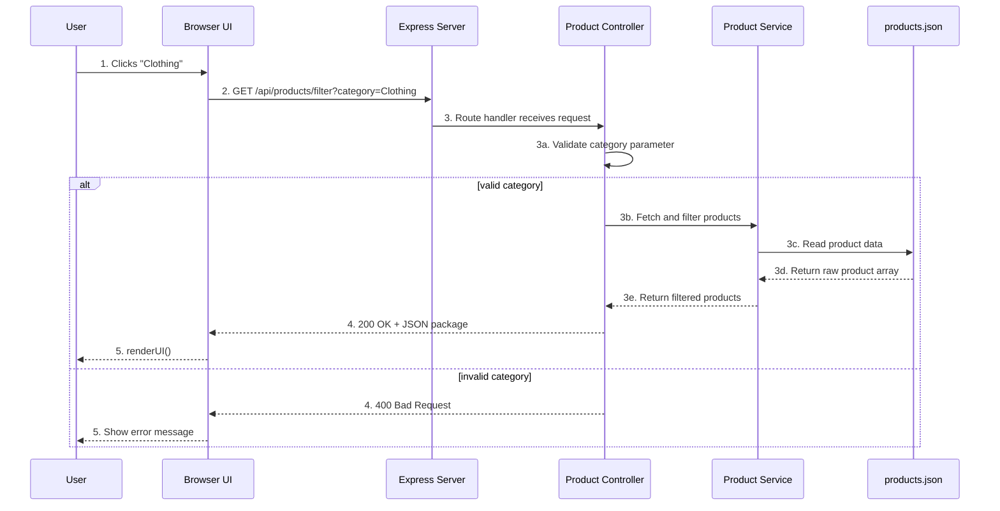

# Weekend Work Submission

## 1. The Contract Table

| Component | Request (The Order) | Response (The Delivery) |
|-----------|---------------------|-------------------------|
| **Method** | GET | 200 OK (or 400/500 on error) |
| **Endpoint** | `/api/products/filter?category=Clothing` | JSON package response |
| **Headers** | `Accept: application/json` | `Content-Type: application/json` |
| **Status Code** | 200 OK / 400 Bad Request / 500 Internal Server Error | 200 OK or error status |
| **Body (Data)** | Empty for GET; category is passed as query param | `[{"id": 5, "title": "Cotton Slim-Fit T-Shirt", ...}]` inside a package |

## 2. Sequence Diagram

## 3. GenAI Prompt

> Convert existing POST `/api/products/filter` to GET `/api/products/filter?category=value` in this Node.js/Express project:
> - `my-backend/src/routes/productRoutes.js`: Change `router.post` to `router.get`
> - `my-backend/src/controllers/productController.js`: Change `req.body` to `req.query`, add validation
> - `index.html`: Update fetch to GET with query params instead of POST with JSON body
> - Keep response format: `{status: "success", package: {products, count, appliedCategory}}`
> - Add comments explaining request/response flow
