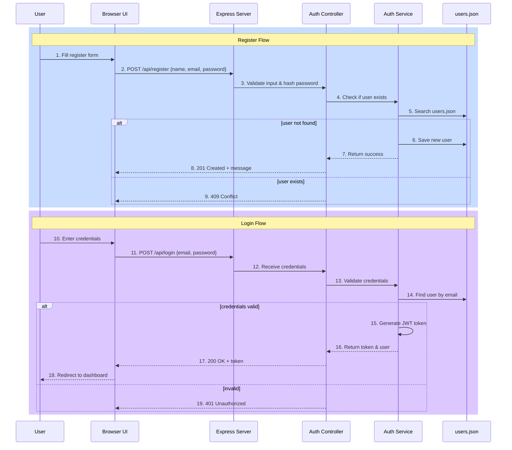

# Tonight Work Submission

## 1. The Contract Table

| Component | Request (The Order) | Response (The Delivery) |
|-----------|---------------------|-------------------------|
| **Register** | POST `/api/register` with `{name, email, password}` | 201 Created / 400 Bad Request / 409 Conflict |
| **Login** | POST `/api/login` with `{email, password}` | 200 OK with JWT token / 401 Unauthorized / 404 Not Found |
| **Headers** | `Content-Type: application/json` | `Content-Type: application/json` |
| **Body (Data)** | `{name, email, password}` or `{email, password}` | `{status, message, token, user}` or error |

## 2. Sequence Diagram

## 3. GenAI Prompt

> Implement authentication system in Node.js/Express:
> - **Register endpoint** (`POST /api/register`): Validate email/password strength, hash password, check duplicate users, save to users.json
> - **Login endpoint** (`POST /api/login`): Verify credentials against users.json, generate JWT token on success
> - **Validation**: Password min 8 chars with uppercase, lowercase, number, special char; email format check
> - **Response format**: `{status: "success"/"error", message: string, token?: string, user?: {id, name, email}}`
> - Add middleware for JWT verification on protected routes
